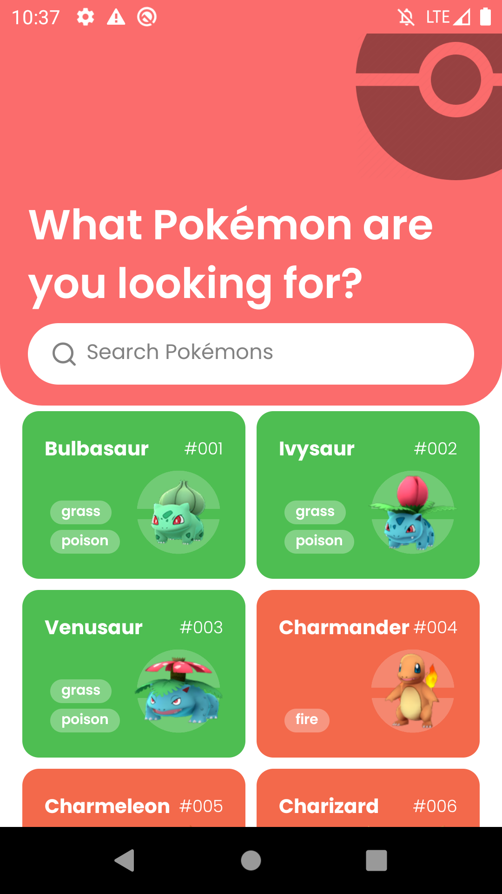
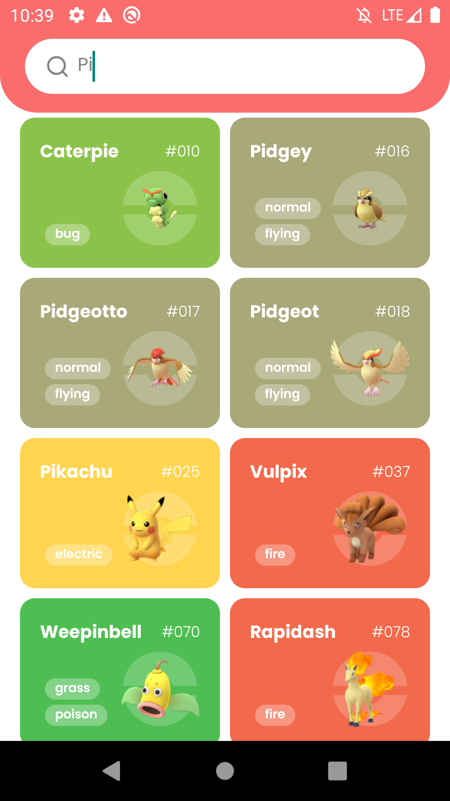
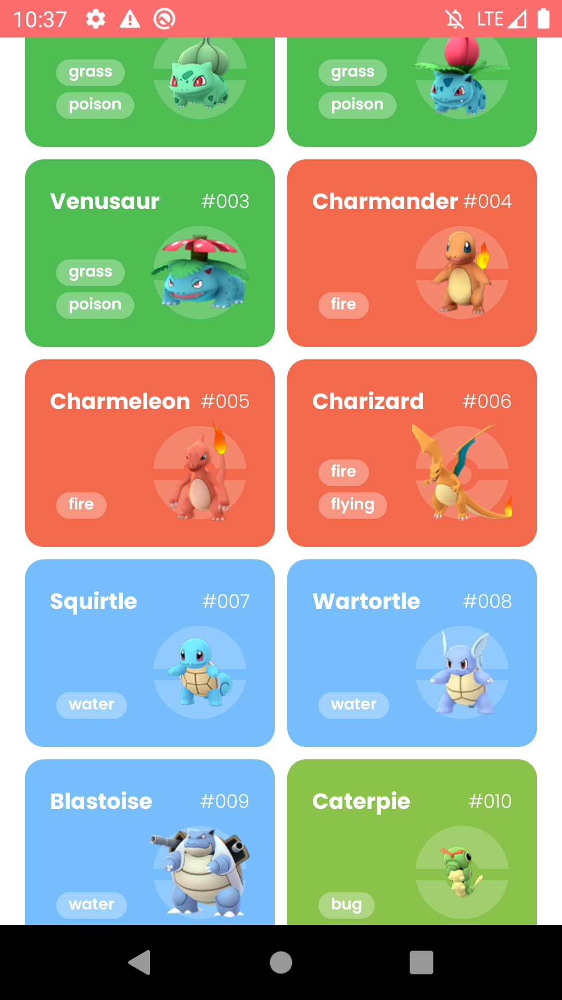
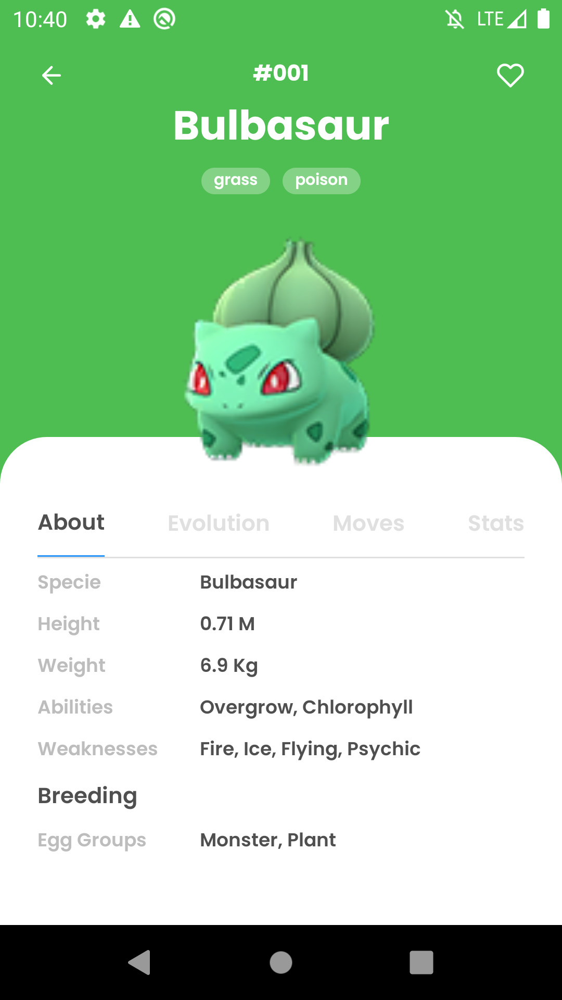
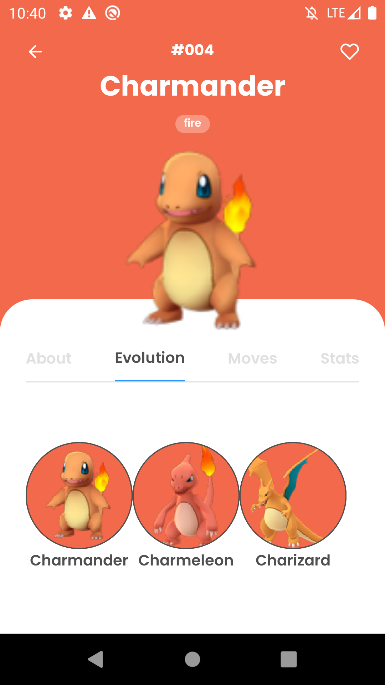
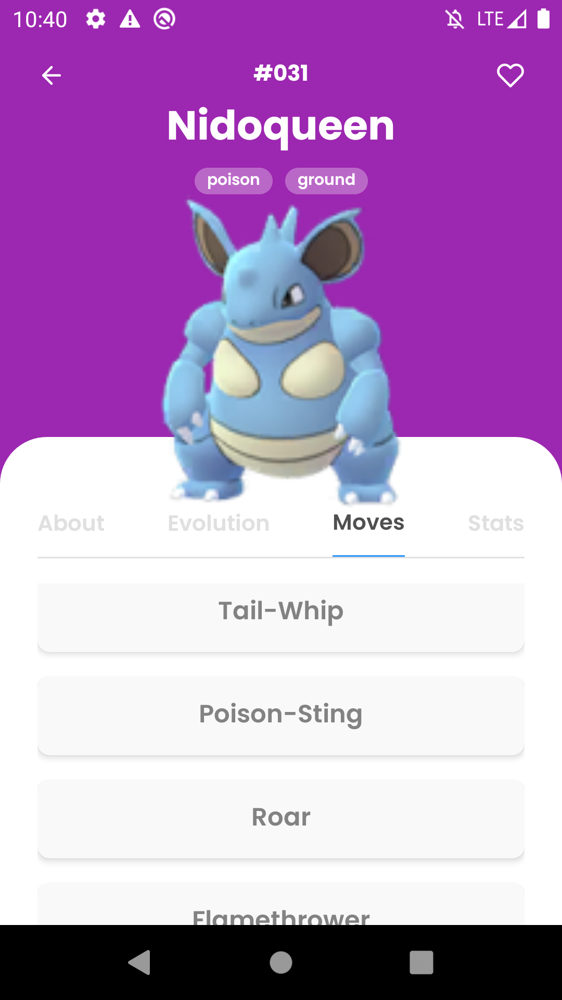
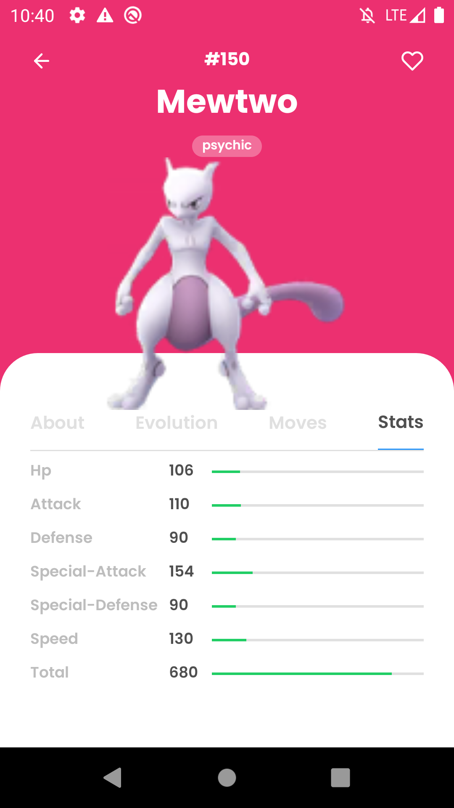

<h3 align="center">
    
</h3>

<h1 align="center">
    Pokédex
</h1>

<p align="center">
   <a href="https://github.com/msvictor">
    
  </a>
</p>

<p align="center">
  <a href="https://developer.mozilla.org/pt-BR/docs/Web/JavaScript">
    
  </a>
  <a href="https://www.typescriptlang.org/">
    
  </a>
  <a href="https://reactnative.dev/">
    
  </a>
  <a href="https://jestjs.io/pt-BR/">
    
  </a>
  <a href="https://styled-components.com/">
    
  </a>
  <a href="https://typicode.github.io/husky/#/">
    
  </a>
  <a href="https://eslint.org/">
    
  </a>
    <a href="https://prettier.io/">
    
  </a>
</p>

## Pokedex

- [About](#about)
- [The Application](#application)
- [Techs](#techs)
- [Clone and use for Free](#clone)

<a id="about"></a>

## :interrobang: About

<strong>Pokedex:</strong> a mobile app as the Pokedex from Pokémon game. This application contains all pokémons from generation 1. The project interface was made based on a prototype built for me on figma. [Check the prototype here](https://www.figma.com/file/A9ayw2reKw4xYcKv3LO4uP/Pokedex?node-id=0%3A1)

<a id="application"></a>

## :sparkles: The Application

<h3 align="center">
    
    
    
</h3>
<h3 align="center">
    
    
    
    
</h3>

<a id="techs"></a>

## :diamonds: Techs

The project was developed with the technologies below:

- [Javacript](https://developer.mozilla.org/pt-BR/docs/Web/JavaScript)
- [Typescript](https://www.typescriptlang.org/)
- [React Native](https://expo.io/)
- [Axios](https://axios-http.com/docs/intro)
- [ESLint](https://eslint.org/)
- [Husky](https://typicode.github.io/husky/#/)
- [Jest](https://jestjs.io/pt-BR/)
- [Lint Staged](https://github.com/okonet/lint-staged)
- [Prettier](https://prettier.io/)
- [React Navigation](https://reactnavigation.org/)
- [React Native Vector Icons](https://github.com/oblador/react-native-vector-icons)
- [React Native Testing Library](https://testing-library.com/docs/react-native-testing-library/intro/)
- [React Hooks Testing Library](https://react-hooks-testing-library.com/reference/api)
- [Styled Components](https://styled-components.com/)

<a id="clone"></a>

## :octocat:Clone this repo

1. Clone :

```sh
  $ git clone https://github.com/msvictor/pokedex.git
```

2. Go to folder:

```sh
  $ cd pokedex
```

3. Execute:

```sh
  $ npm install

  # on android
  $ npm run android

  # or on ios
  $ npm run ios
```

## :memo: License

This project is under MIT LICENSE. for more details follow the link: [LICENSE](LICENSE).
